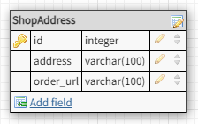
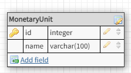
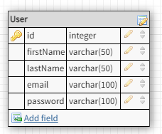

## Statik məlumatlar

## Dinamik məlumatlar

1. header-info section -> header-info-contact.

    

2. header-info section -> address

    

3. header-info section -> MonetaryUnit

    

4. User log-in ve register sehifeleri üçün

    

5. Products

    